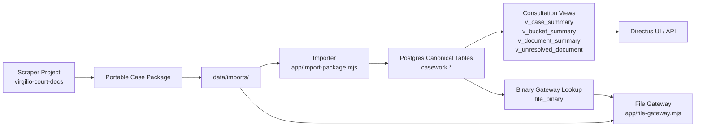

# Import Pipeline

Last updated: 2026-08-30

## Purpose

The consultation workspace does not scrape the court system directly.

It imports a settled portable package produced by the scraper project, stores the canonical metadata in Postgres, and exposes both metadata and binaries for consultation.

## Diagram



## Stages

### 1. Portable package export

The scraper repository exports a settled case package from the scraper-side SQL Server corpus.

Current producer:

- `D:\attila\projects\virgilio-court-docs\scripts\node\tribunais-build-portable-case-package.mjs`

### 2. Package placement

The exported package is copied into:

- `data/imports/<package_id>/`

The package contains:

- manifest metadata in `package.json`
- canonical JSONL datasets under `cases/`
- binary files under `files/sha256/`
- unresolved and provenance artifacts under `artifacts/` and `provenance/`

### 3. Import into Postgres

The importer reads the package and upserts it into the canonical schema.

Importer:

- [import-package.mjs](D:\attila\projects\virgilio-case-workspace\app\import-package.mjs)

Main mappings:

- `cases/cases.jsonl` -> `casework.case_file`
- `cases/buckets.jsonl` -> `casework.bucket`
- `cases/documents.jsonl` -> `casework.document`
- `cases/bucket_documents.jsonl` -> `casework.bucket_document`
- `cases/file_binaries.jsonl` -> `casework.file_binary`
- `cases/document_binaries.jsonl` -> `casework.document_binary`

For file resolution, the importer also records:

- `file_binary.storage_package_id`
- `file_binary.storage_rel_path`

### 4. Consultation projection

The normalized canonical tables are projected into read-oriented SQL views for easier human use.

Views:

- `casework.v_case_summary`
- `casework.v_bucket_summary`
- `casework.v_document_summary`
- `casework.v_unresolved_document`

### 5. Consumption

Two consultation entry points currently exist:

- Directus for metadata browsing
- the SHA-based file gateway for binary serving

Directus:

- `http://localhost:8055`

Gateway:

- `http://localhost:8090/binary/<sha256>`

## Operational Commands

From `D:\attila\projects\virgilio-case-workspace`:

```bash
docker compose up -d
npm install
npm run import:package -- data/imports/<package-dir>
```

## Current Boundaries

Included now:

- portable package import
- canonical Postgres persistence
- consultation views
- binary serving by SHA-256

Not yet included:

- live scrape ingestion
- automated package discovery
- OCR pipeline
- full-text indexing
- Directus collection presets automation
- dossier generation
